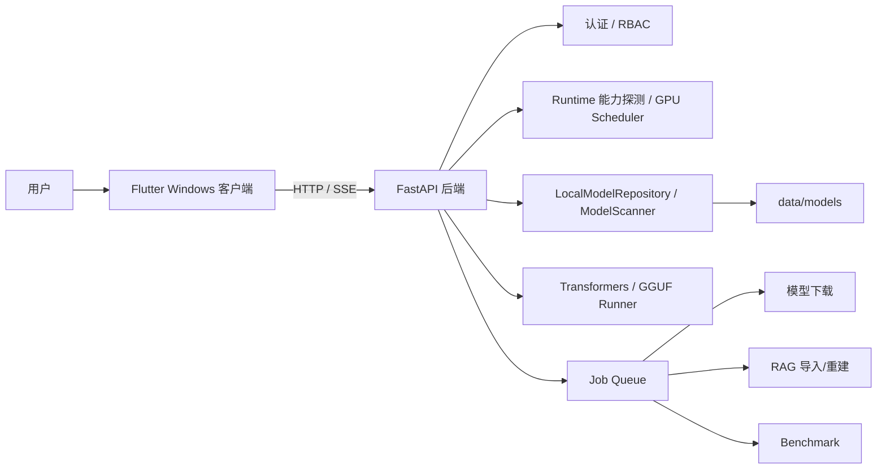

# LLM-Studio

LLM-Studio 是一个面向 Windows 本地大模型使用场景的桌面工作台。当前项目已经从旧 CLI / Web 原型架构迁移为：

- Flutter Windows 桌面客户端：`apps/flutter_studio/`
- Python FastAPI 后端服务：`llm_studio/`
- 后端启动方式：`python -m llm_studio.server --host 127.0.0.1 --port 8000`
- 模型仓库：`data/models/`，由 `LocalModelRepository` 和 `ModelScanner` 统一管理

当前后端不打包 exe，不依赖 `llm-studio.exe`，不依赖旧 `llm_studio.cli`，也不依赖 `click` 来启动服务。旧虚拟环境中如果还残留 `venv\Scripts\llm-studio.exe`，它只是历史 editable install 生成的 console script，不是当前项目入口。

## 目标环境

推荐生产和调试环境：

- 操作系统：Windows 11 x64
- Python：3.12 x64
- GPU：NVIDIA CUDA GPU，目标验证设备为 RTX 5060 Laptop 8GB
- PyTorch：CUDA 构建，Windows 推荐 wheel index：`cu132`
- Flutter：启用 Windows desktop

普通 requirements 不包含 `torch`、`torchvision`、`torchaudio`。CUDA PyTorch 必须单独安装，避免 CPU 版 PyTorch 被依赖解析误装。

## 项目目录

```text
LLM-Studio/
├── llm_studio/                  # Python FastAPI 后端
│   ├── api_server.py             # API 路由和应用装配
│   ├── server.py                 # 纯 Python 服务入口
│   ├── chat/                     # 多轮消息、PromptBuilder、历史裁剪
│   ├── runtime/                  # CUDA 能力探测、加载策略、GPU Scheduler
│   ├── models/                   # 本地模型仓库、扫描、兼容性评估
│   ├── downloads/                # Hugging Face 下载任务
│   ├── jobs/                     # 后台任务队列和持久化
│   ├── rag/                      # RAG 配置、中文切块、索引
│   ├── adapters/                 # LoRA Adapter 扫描和生命周期
│   ├── benchmarks/               # 推理基准测试
│   ├── storage/                  # 磁盘空间和 cleanup
│   ├── diagnostics/              # 脱敏诊断包
│   ├── auth/                     # RBAC 角色和权限
│   └── security/                 # 上传安全等
├── apps/flutter_studio/          # Flutter Windows 桌面客户端
├── requirements/                 # 分层依赖
├── configs/                      # 推荐配置和预设
├── scripts/                      # Windows 开发和启动脚本
├── tests/                        # Python 测试
├── config.yaml                   # 默认本地配置
└── README.md                     # 唯一主文档
```

运行数据默认写入 `data/` 下，并已通过 `.gitignore` 排除：

```text
data/models/
data/downloads/
data/uploads/
data/rag/
data/benchmarks/
data/diagnostics/
data/trash/
logs/
```

## 架构概览



核心设计：

- Flutter 是当前第一客户端，优先支持 Windows desktop。
- Python 后端是纯服务进程，由 Flutter 自动启动或用户手动启动。
- API 采用本地 HTTP，流式聊天使用 SSE。
- 模型事实来源统一为 `models.root_dir`，不再从旧 `./models` 自动找模型。
- 单 GPU 默认同一时间只运行一个重型 GPU 任务，避免 8GB 显存被并发任务打爆。
- 长任务通过 Job Queue 返回任务 ID，前端轮询状态。

## 安装依赖

创建 Python 3.12 虚拟环境：

```powershell
py -3.12 -m venv .venv
.\.venv\Scripts\Activate.ps1
python -m pip install --upgrade pip setuptools wheel
```

安装基础后端和 Web 服务依赖：

```powershell
python -m pip install -r requirements/base.txt
python -m pip install -r requirements/web.txt
python -m pip install -e .
```

安装 CUDA PyTorch：

```powershell
.\scripts\install_windows_cuda.ps1
```

可选能力按需安装：

```powershell
python -m pip install -r requirements/rag.txt
python -m pip install -r requirements/cuda.txt
python -m pip install -r requirements/gguf.txt
python -m pip install -r requirements/finetune.txt
python -m pip install -r requirements/vision.txt
python -m pip install -r requirements/dev.txt
```

不要把 `torch>=...` 加回普通 requirements；CPU 版 torch 也能满足这种依赖，无法保证 CUDA 可用。

## 启动后端服务

推荐命令：

```powershell
python -m llm_studio.server --host 127.0.0.1 --port 8000
```

等价模块入口：

```powershell
python -m llm_studio --host 127.0.0.1 --port 8000
```

查看参数：

```powershell
python -m llm_studio.server --help
```

支持参数：

- `--host`：默认 `127.0.0.1`
- `--port`：默认 `8000`
- `--reload`：开发模式自动重载
- `--log-level`：Uvicorn 日志等级
- `--config`：指定配置文件，同时设置 `LLM_STUDIO_CONFIG`

也可以使用脚本：

```powershell
.\scripts\start_backend_service.ps1
```

该脚本会检查 Python、`llm_studio` 和 `uvicorn` 是否可导入，然后启动 `llm_studio.server`。

## 启动 Flutter 桌面端

从仓库根目录运行：

```powershell
.\scripts\flutter_run_windows.ps1
```

或直接运行：

```powershell
cd apps\flutter_studio
flutter run -d windows --dart-define="LLM_STUDIO_ROOT=D:\develop\LLM-Studio\LLM-Studio"
```

如果 Python 不在项目 `.venv` 中，可以指定 Python：

```powershell
flutter run -d windows `
  --dart-define="LLM_STUDIO_ROOT=D:\develop\LLM-Studio\LLM-Studio" `
  --dart-define="LLM_STUDIO_PYTHON=D:\path\to\python.exe"
```

Flutter 自动启动后端时使用：

```text
python.exe -m llm_studio.server --host 127.0.0.1 --port 8000
```

Python 检测顺序：

1. Settings 中保存的 `localPythonPath`
2. `LLM_STUDIO_PYTHON`
3. 项目 `.venv\Scripts\python.exe`
4. 项目 `venv\Scripts\python.exe`
5. PATH 中的 `python`
6. Windows launcher：`py -3.12`

启动前会验证：

```powershell
python -c "import sys; print(sys.executable)"
python -c "import llm_studio; print(llm_studio.__file__)"
python -c "import uvicorn; print(uvicorn.__version__)"
```

如果 `llm_studio` 不可导入：

```powershell
python -m pip install -e .
```

如果 `uvicorn` 不可导入：

```powershell
python -m pip install -r requirements/web.txt
```

## 首次初始化和认证

后端默认启用本地认证。首次启动流程：

1. Flutter 启动或连接后端。
2. 请求 `GET /health`。
3. 请求 `GET /v1/setup/status`。
4. 若 `requires_setup=true`，显示初始化页面。
5. 用户设置管理员密码。
6. 后端创建管理员和首个 API Key。
7. API Key 明文只在初始化响应中返回一次。
8. Flutter 保存 API Key，后续请求自动携带认证头。

认证头：

```http
Authorization: Bearer <api_key>
X-User-ID: <user_id>
X-API-Key: <api_key>
```

安全说明：

- 管理员密码使用哈希存储，不保存明文。
- API Key 后端只保存哈希。
- Flutter 当前使用 `shared_preferences` 保存 API Key；这不是 Windows Credential Manager 级别的安全密钥库。
- 后端日志和 Flutter 后端日志展示会脱敏 `Authorization`、API Key、Cookie、password、token。

RBAC 角色：

| 角色 | 典型权限 |
| --- | --- |
| `viewer` | 查看 runtime、模型列表、任务状态、存储状态 |
| `operator` | 聊天、加载/卸载模型、RAG 查询或普通操作 |
| `admin` | 模型扫描/注册/删除、下载、Benchmark、Storage cleanup、诊断导出、用户和 API Key 管理 |

## API 调试

健康检查：

```powershell
curl http://127.0.0.1:8000/health
```

初始化状态：

```powershell
curl http://127.0.0.1:8000/v1/setup/status
```

能力状态：

```powershell
curl http://127.0.0.1:8000/v1/capabilities
```

运行时信息：

```powershell
curl http://127.0.0.1:8000/v1/runtime `
  -H "Authorization: Bearer <api_key>"
```

扫描模型：

```powershell
curl -X POST http://127.0.0.1:8000/v1/models/scan `
  -H "Authorization: Bearer <api_key>"
```

查看模型：

```powershell
curl http://127.0.0.1:8000/v1/models `
  -H "Authorization: Bearer <api_key>"
```

加载模型：

```powershell
curl -X POST http://127.0.0.1:8000/v1/models/<model_id>/load `
  -H "Authorization: Bearer <api_key>"
```

查看当前模型：

```powershell
curl http://127.0.0.1:8000/v1/models/current `
  -H "Authorization: Bearer <api_key>"
```

非流式聊天：

```powershell
curl -X POST http://127.0.0.1:8000/v1/chat/completions `
  -H "Content-Type: application/json" `
  -H "Authorization: Bearer <api_key>" `
  -d '{
    "model": "<model_id>",
    "stream": false,
    "messages": [
      {"role": "system", "content": "你是一个简洁可靠的本地助手。"},
      {"role": "user", "content": "你好，介绍一下当前项目。"}
    ]
  }'
```

流式聊天：

```powershell
curl -N -X POST http://127.0.0.1:8000/v1/chat/completions `
  -H "Content-Type: application/json" `
  -H "Authorization: Bearer <api_key>" `
  -d '{
    "model": "<model_id>",
    "stream": true,
    "messages": [
      {"role": "user", "content": "用三句话说明 RAG 是什么。"}
    ]
  }'
```

RAG 查询使用 `question` 字段，`top_k` 默认 5：

```powershell
curl -X POST http://127.0.0.1:8000/v1/rag/query `
  -H "Content-Type: application/json" `
  -H "Authorization: Bearer <api_key>" `
  -d '{
    "question": "这个知识库里提到了什么？",
    "top_k": 5
  }'
```

Adapter 操作需要当前基础模型上下文；如果后端已有已加载模型，可以省略 `model`，否则必须传入模型 ID：

```powershell
curl -X POST http://127.0.0.1:8000/v1/adapters/<adapter_id>/load `
  -H "Content-Type: application/json" `
  -H "Authorization: Bearer <api_key>" `
  -d '{
    "model": "<model_id>"
  }'
```

删除模型默认是移入回收站，必须显式二次确认：

```powershell
curl -X DELETE "http://127.0.0.1:8000/v1/models/<model_id>?confirm=true" `
  -H "Authorization: Bearer <api_key>"
```

任务列表：

```powershell
curl http://127.0.0.1:8000/v1/jobs `
  -H "Authorization: Bearer <api_key>"
```

GPU 调度状态：

```powershell
curl http://127.0.0.1:8000/v1/gpu/scheduler `
  -H "Authorization: Bearer <api_key>"
```

## Flutter 调试

常用命令：

```powershell
cd apps\flutter_studio
flutter pub get
flutter analyze
flutter test
flutter build windows
flutter run -d windows
```

项目脚本：

```powershell
.\scripts\flutter_analyze.ps1
.\scripts\flutter_test.ps1
.\scripts\flutter_build_windows.ps1
.\scripts\flutter_run_windows.ps1
.\scripts\dev_start_all.ps1
```

Flutter 页面：

- Setup：首次初始化管理员和 API Key。
- Status：runtime、GPU scheduler、capabilities、Job Center。
- Models：扫描、刷新、加载、卸载、选择聊天模型、删除保护。
- Chat：非流式 / SSE 流式、停止生成、清空历史、重新生成、复制消息。
- Downloads：创建 Hugging Face 下载任务、查看真实进度、速度、ETA、取消请求、重试，并在成功后自动扫描注册模型。
- RAG：最小查询入口。
- Adapters：扫描、加载、激活、停用 Adapter。
- Benchmarks：实验性本机基准测试。
- Storage：cleanup preview 和执行。
- Diagnostics：导出脱敏诊断包。
- Settings：本地/远程后端、API 设置、后端日志、重启/停止后端。

后端日志支持在 Settings 中查看和复制，复制前会脱敏。

## 模型管理

统一模型配置：

```yaml
models:
  root_dir: ./data/models
  temp_dir: ./data/downloads
  metadata_cache: ./data/model_index.json
  adapters_dir: ./data/adapters
  allow_external_paths: true
  follow_symlinks: false
  minimum_free_space_gb: 10
```

扫描器只读取元数据，不加载完整权重，不执行模型仓库中的自定义 Python 代码。

支持识别：

- Transformers：`config.json`、`tokenizer.json`、`*.safetensors`、`pytorch_model*.bin`
- GGUF：`*.gguf`
- GPTQ / AWQ：`quantize_config.json`、`quant_config.json`、量化权重文件

旧配置中的顶层 `models_dir` 仍可读取；如果没有 `models.root_dir`，会在加载时映射为 `models.root_dir`。新配置不要继续使用顶层 `models_dir`。

## RTX 5060 Laptop 8GB 建议

推荐：

- 1B 到 3B：优先 BF16 / SDPA，不强制 4bit。
- 7B / 8B：优先 4bit、GGUF Q4 或 CPU offload。
- 14B：高风险，需要大量 CPU offload，不建议默认加载。
- 32B 及以上：本机默认不推荐。

运行时策略会考虑：

- CUDA 是否可用
- BF16 是否支持
- bitsandbytes 4bit 探针是否通过
- llama.cpp 是否为 CUDA 构建
- GPTQModel 是否安装
- `max_gpu_memory` 和 `max_cpu_memory`

推荐显存上限：

```yaml
runtime:
  max_gpu_memory: 7GiB
  max_cpu_memory: auto
  attention_backend: sdpa
  trust_remote_code: false
```

## RAG

默认 embedding 设备为 CPU，避免抢占 8GB GPU：

```yaml
rag:
  device: cpu
  embedding_model: BAAI/bge-small-zh-v1.5
  chunk_size: 500
  chunk_overlap: 50
```

中文切块策略：

1. 优先按标题。
2. 再按自然段。
3. 再按中文句号、问号、感叹号。
4. 最后按最大长度切分。
5. chunk 保留 source、page、title、chunk_index 等元数据。

索引保存会记录 schema version、embedding model、embedding dimension、documents、chunks。模型或维度不一致时会拒绝读取旧索引并提示重建。

RAG 上传文件继续走安全上传模块。`file_path` / `directory_path` 这类读取后端本机路径的接口默认禁用；如确需使用，必须由管理员启用 `security.local_path_access.enabled`，并把路径限制在 `allowed_roots` 之内。越界路径会返回 `RAG_PATH_NOT_ALLOWED`，不会读取任意系统文件。

## LoRA Adapter

Adapter 目录默认：

```text
data/adapters/
```

后端支持扫描 Adapter，并读取：

- `adapter_config.json`
- `adapter_model.safetensors`
- `adapter_model.bin`

支持后端生命周期：

- 扫描
- 注册
- 加载
- 激活
- 停用
- 卸载

LoRA merge 当前按能力表标记为未完整实现或实验性边界，不能假装已经稳定可用；未实现 executor 会以明确 Job 失败状态返回，不会修改基础模型。

## Benchmark

Benchmark 只用于本机开发参考，受驱动版本、后台进程、温度、功耗墙、上下文长度和采样参数影响。

记录指标：

- 模型加载时间
- tokenizer 加载时间
- TTFT
- 生成总耗时
- 输出 token 数
- token/s
- 输入 token 数
- CUDA allocated / reserved 峰值
- 进程内存
- GPU / PyTorch / CUDA 信息
- dtype / quantization / backend / attention backend

Token/s 不包含模型加载时间；TTFT 从请求开始到第一个 token 到达计算。

## Storage Cleanup

Cleanup 先 preview，再执行。默认不会删除：

- 正式模型
- 外部注册模型原文件
- LoRA Adapter
- RAG 原始文档
- 用户配置

可清理类别包括：

- 临时上传
- 失败下载
- 旧 Benchmark 报告
- 旧日志
- 诊断包
- 回收站
- 项目内 Hugging Face cache 中未引用内容

全局 Hugging Face cache 默认只展示占用，不自动删除。

## Diagnostics

诊断包允许包含：

- runtime 能力
- Python / PyTorch / CUDA / GPU 信息
- 脱敏配置
- 最近错误日志
- 任务摘要
- 模型元数据摘要
- 磁盘空间摘要
- 能力状态表

禁止包含：

- 模型权重
- 完整聊天记录
- RAG 文档正文
- 上传文件内容
- 明文 API Key
- API Key 哈希
- 管理员密码哈希
- Authorization Header
- Cookie
- Hugging Face Token
- 用户完整家目录路径

路径会脱敏，例如：

```text
C:\Users\zkjr\...
%USERPROFILE%\...
```

## 能力状态

后端真实能力以 `GET /v1/capabilities` 为准。当前状态摘要：

| 能力 | 状态 | Flutter | 说明 |
| --- | --- | --- | --- |
| `chat_non_stream` | available | yes | 使用已选择/已加载模型 ID |
| `chat_stream` | available | yes | 后端 SSE 与 Flutter Windows 基础流式/停止生成能力已接入 |
| `model_scan` | available | yes | 使用统一模型仓库，不加载权重 |
| `model_load` | available | yes | 经过 runtime policy 和 GPU scheduler |
| `model_unload` | available | yes | 释放 runtime 状态 |
| `model_download` | available | yes | 下载作为后台 Job 运行，Flutter 可创建和查看任务 |
| `model_download_progress` | partial | yes | 有真实总字节时显示百分比；未知时 `total_bytes` 和 `percent` 为 null |
| `model_download_cancel` | partial | yes | 协作式取消；当前文件传输可能完成后才停止 |
| `model_download_retry` | available | yes | failed / cancelled / interrupted 任务可重试 |
| `model_download_resume` | partial | partial | retry 复用 Hugging Face cache，不声明严格暂停/续传 |
| `model_download_auto_register` | available | yes | 下载成功后自动触发扫描并把 `model_id` 写回任务 |
| `rag_query` | partial | yes | Flutter 有最小查询页面；本地路径导入默认禁用并仅限管理员 allowlist |
| `rag_import` | backend_only | no | 后台任务导入，Flutter 暂未暴露完整导入控件 |
| `vision_ocr` | backend_only | no | 后端受 GPU scheduler 保护 |
| `lora_scan` | partial | yes | Flutter 有 Adapter 页面 |
| `lora_load` | partial | yes | 依赖 PEFT、当前基础模型和兼容性校验 |
| `lora_activate` | partial | yes | 支持激活/停用，默认同一时间一个 Adapter |
| `lora_unload` | partial | partial | 后端支持卸载；Flutter 当前暴露扫描、加载、激活、停用 |
| `lora_merge` | not_implemented | no | 不默认暴露，不修改基础模型 |
| `benchmark` | experimental | partial | 仅供本机开发参考，Flutter 仅启动当前模型测试 |
| `benchmark_with_adapter` | not_implemented | no | 当前不展示 Adapter 选择，避免误导 |
| `storage_cleanup` | partial | yes | preview 优先，只删允许目录 |
| `diagnostics_export` | partial | yes | 脱敏导出，不包含权重、正文或密钥 |
| `flutter_windows` | available | yes | 当前第一平台 |
| `flutter_android` | not_implemented | no | Planned |
| `flutter_linux` | not_implemented | no | Planned |
| `flutter_macos` | not_implemented | no | Planned |
| `flutter_web` | not_implemented | no | 旧 Web UI 已被 Flutter Windows 取代 |

## 开发验证

后端：

```powershell
.\scripts\test_backend.ps1
```

等价核心命令：

```powershell
python -m compileall llm_studio
python -m pytest --basetemp .tmp\pytest
python -m ruff check llm_studio tests
python -m pip check
python -m llm_studio.server --help
```

Flutter：

```powershell
.\scripts\test_flutter.ps1
```

等价核心命令：

```powershell
cd apps\flutter_studio
flutter analyze
flutter test
flutter build windows
```

环境诊断：

```powershell
.\scripts\diagnose_environment.ps1
.\scripts\doctor.ps1
python -m llm_studio.runtime.diagnostics
```

服务 smoke test：

```powershell
python -m llm_studio.server --host 127.0.0.1 --port 8000
curl http://127.0.0.1:8000/health
```

如果 smoke test 报 `ModuleNotFoundError: No module named 'uvicorn'`，说明当前 Python 环境还没有安装 Web 依赖：

```powershell
python -m pip install -r requirements/web.txt
```

## 旧架构清理记录

已删除：

- `llm_studio/cli.py`
- `llm_studio/downloader.py`
- `tools/encoding_conversion_report.json`

已确认：

- `pyproject.toml` 无 `[project.scripts]`
- 普通依赖中无 `click`
- Flutter 不启动 `llm-studio.exe`
- Flutter 不启动 `llm_studio.cli`
- 旧 `ModelDownloader` 不再参与主流程
- 生产代码不固定 `model=auto`
- 上传文件不使用用户文件名直接拼路径

保留兼容：

- 旧用户配置中的 `models_dir` 可被读取并迁移到 `models.root_dir`
- README 允许提到旧 `llm-studio.exe` 是废弃残留，避免用户误解虚拟环境里的旧文件

## 常见问题

**`torch` 显示 `+cpu`**

说明安装的是 CPU 版 PyTorch。重新执行：

```powershell
.\scripts\install_windows_cuda.ps1
```

**`torch.cuda.is_available()` 是 `False`**

检查 NVIDIA 驱动、CUDA PyTorch wheel、当前 Python 环境和 `python.exe` 路径是否一致。

**`uvicorn` 不存在**

安装 Web 依赖：

```powershell
python -m pip install -r requirements/web.txt
```

**Flutter 提示找不到项目根目录**

启动时传入：

```powershell
--dart-define="LLM_STUDIO_ROOT=D:\develop\LLM-Studio\LLM-Studio"
```

或在 Settings 中配置本地后端 root。

**没有模型时 Chat 不可用**

先进入 Models 页面扫描或注册模型，然后加载 ready 模型。Chat 请求必须使用当前模型 ID，不再默认固定 `auto`。

**Benchmark 数值波动**

这是正常现象。Benchmark 仅供本机开发参考，不代表稳定硬件评分。
